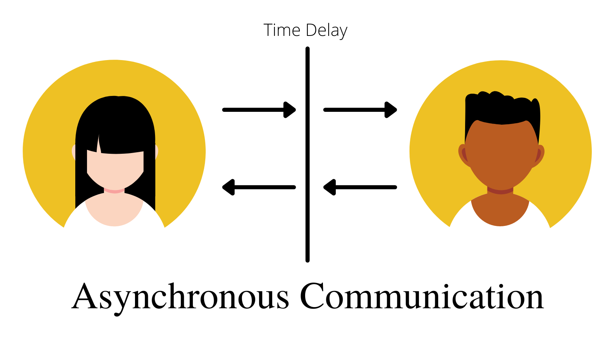

<h1 align="center">Grocery-Shopping-Micro-Services 👨‍💻🚀</h1>

 <h2 align="center">Welcome! 👋</h2>
  <h4 align="center">Project status : under development⌛⏳.</h4>
  <h5 align="center">This project is an grocrey_shopping API  based on microservice architecture</h5>

 <h2 align="center">Main Technologies</h2>
<table>
  <tr>
    <td>Node.js</td>
    <td>MicroServices Architecture  </td>
     <td>Asynchronous Microservices Communication.  </td>
     <td>RabbitMQ</td>
    <td>Docker</td>
  </tr>
  <tr>
     <td></td>
    <td></td>
    <td></td>
    <td></td>
    <td></td>
  </tr>
 </table>
 

 
 
<h2 align="center">Built with</h2>
<table>
  <tr>
      <td><li color="grean">Restful Api</li></td>
      <td><li>Node.js</li> </td>
      <td><li>RabbitMQ</li></td>
      <td><li>Express</li></td>
    </tr>
   <tr>
    <td><li>jsonwebtoken (JWT)</li></td>
    <td><li>AWS Elastic beanstalk</li></td>
    <td><li>Nginx</li></td>
  </tr>
  <tr>
    <td><li>MongoDB</li></td>
    <td><li>Docker</li></td>
   </tr>
 </table>
 
 <h2 align="center">Author</h2>
  <h5 align="center"> <a href="https://www.linkedin.com/in/ahmednabil22/">- LinkedIn-@ahmednabil/ </a> </h5>
